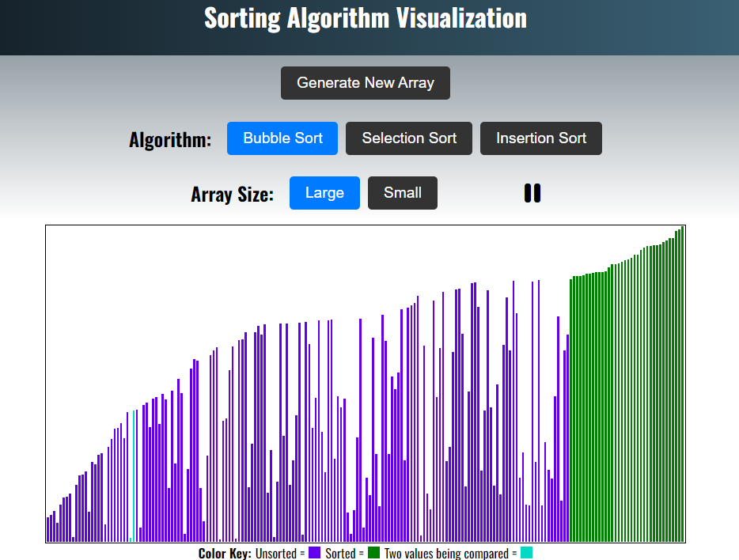

# Sorting Algorithm Visualization App

## Front end application using JavaScript and React to visually illustrate sorting algorithms through dyanmic animations.


<!--  -->

## Algorithms Implemented
- Bubble Sort
- Selection Sort
- Insertion Sort

## Example of sorting algorithm implementation
The following is how the Bubble Sort algorithm is implemented into the project. First we set two state variables i and j which will be the two values being compared, and we set a bound variable which is the length of the array and gets decremented at each iteration. A temporary array is set which will hold the updated array after the value check. If i is greater than j then they get swapped. After the check is done, i and j get incremented and bound gets decremented and the function is called again recursively.
```javascript
    const bubbleSort = () => {
        if(j === 1) {
            setHighlightIndices([1000, 1001]);
        }
        if(!done && j < bound && play){
            let arr = [...newArray];
            if(arr[i] > arr[j]){
                let temp = arr[j];
                arr[j] = arr[i];
                arr[i] = temp;
            }
            if(bound < 1){ 
                setDone(true);
            } else{ //not done
                setI(i + 1);
                setj(j + 1);
                if(j + 1 === bound){ //reset i and j if at the end of array and decrement bound
                    setI(0);
                    setj(1);
                    setBound(bound - 1);
                }
                setHighlightIndices([i, j]);
                setNewArray(arr);
            }
        }
    }
    if(size === 'Large'){
        setTimeout(bubbleSort, 3);
    } else{
        setTimeout(bubbleSort, 200);
    }
```

## Deployment details
The entire is app is hosted on [Github Pages](https://pages.github.com/).
